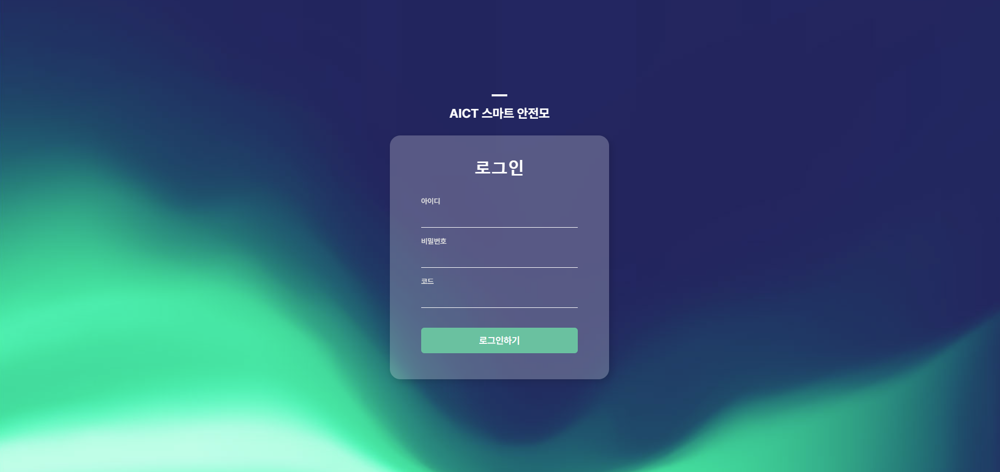
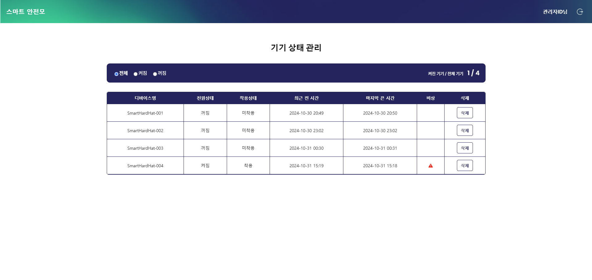

# Flask 기반 웹사이트 구축 개요

## 🌐 라즈베리파이5 서버 구조

- index.py: 관리자 페이지 (로그인 및 기기 상태 조회)
- mqtt3.py: MQTT 브로커 (스마트 안전모 토픽 구독)
- venv: 가상환경에서 서버 실행

## 🚪 포트 및 도메인 정보
- Flask 서버: 5000번 포트
- MQTT 브로커: 1883번 포트
- Node-Red: 1880번 포트
- 도메인: smartadmin.aictlab.com

## 🔒 보안 설정
- SSL 적용 및 Nginx 리버스 프록시: 안전한 접속을 위해 SSL을 적용하고 Nginx를 사용한 리버스 프록싱 구성
- 정적 리소스 캐싱: 빠른 페이지 로딩을 위해 정적 리소스 캐싱 적용

## 🔄 무중단 서비스
- 데몬 파일과 백그라운드 실행: 24시간 무중단 서비스를 유지하도록 설정

## 👤 관리자 페이지 접속 정보
- URL: smartadmin.aictlab.com
- 아이디: admin
- 비밀번호: aict2024!!
- 인증코드: AICT

## 🔗 기기 상태 테스트 (Node-Red)
- 테스트 URL: smartadmin.aictlab.com/nodered/ui/

## 📷 스크린샷

### 로그인 페이지

### 메인 페이지
